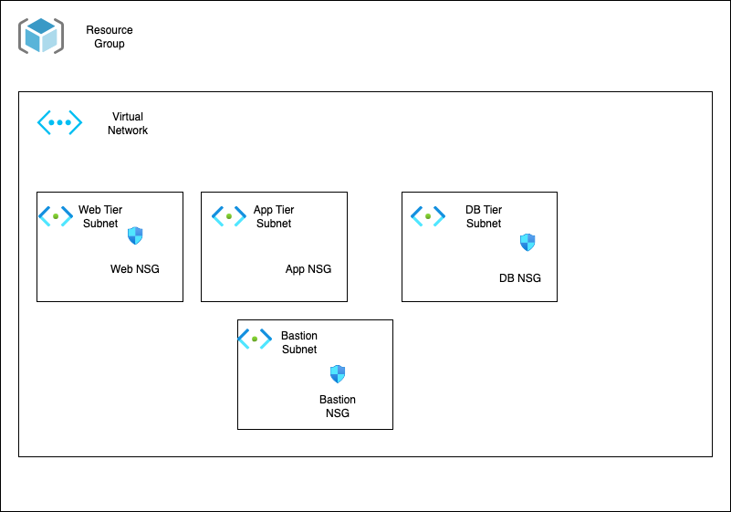

## Suggested Order for Hands-On Files

To get the most out of this hands-on module, follow this order when reviewing or editing the Terraform files in the `tf-manifests` folder:

1. **versions.tf** – Set provider and Terraform version constraints.
2. **generic-input-variables.tf** – Review and adjust global input variables (location, resource group name, etc.).
3. **locals.tf** – Understand local values for naming and tagging.
4. **random-resources.tf** – See how random resources are used for uniqueness.
5. **resource-group.tf** – Create the Azure Resource Group.
6. **vnet-input-variables.tf** – Review VNET and subnet-specific variables.
7. **virtual-network.tf** – Define the main VNET resource.
8. **bastion-subnet-nsg.tf** – Add the Bastion subnet and its NSG.
9. **app-subnet-nsg.tf** – Add the App subnet and its NSG.
10. **web-subnet-nsg.tf** – Add the Web subnet and its NSG.
11. **db-subnet-nsg.tf** – Add the DB subnet and its NSG.
12. **vnet-outputs.tf** – Review outputs for VNET and subnets.
13. **terraform.tfvars** – Optionally override variable values for your environment.

This order helps you understand the flow from provider setup, through variables and locals, to resource creation and outputs.

---

# Explore: Azure Virtual Network, Subnets, and NSG

This section is all about experimenting with Terraform to shape a real-world Azure Virtual Network (VNET) environment. The goal: build out a multi-tier network design, try out useful Terraform features, and see how everything connects in Azure.

---

## What’s Inside

- Resource Group
- Virtual Network (VNET)
- Four Subnets: Bastion, App, Web, and DB
- Four Network Security Groups (NSGs) with rules

### Visuals

*VNET Diagram*



*Azure VNET Network Topology*


These diagrams give a quick sense of the resources and relationships you’ll spin up.

---

## Terraform Concepts in Action

- Terraform Settings Block
- Terraform Provider Block
- Input Variables
- Local Values
- Output Values
- `depends_on` Meta Argument
- `for_each` Meta Argument
- Random Resource

---

## Azure Resources in Play

- Resource Group
- Virtual Network
- Subnets (Bastion, App, Web, DB)
- NSGs & Rules

---

## Input Variables

Input variables serve as parameters for a Terraform module, allowing aspects of the module to be customized without altering the module's own source code, and allowing modules to be shared between different configurations

## Local Value

- Local Value assigns a `name to an expression`, so you can use that `name` multiple times within a module without repeating it.
- Local Values are like a `function's temporary local variables`
- Once local valueis declared, you can reference it in expressions as `local.<Name>`
- Local values can be helpful to `avoid repeating` the same values or expressions `multiple times` in configuration
- If `oersused` they can also make a configuration hard to read by future maintainers `by hiding` the actual values used
- The ability to easily change the value in a control place is the key advantage` of local values

```t

locals {
    common_tags = {
        Service = local.service_name
        Owner = local.owner
    }
}

```

## TF Random Provider

Generate random values [Read More](https://registry.terraform.io/providers/hashicorp/random/latest/docs)


## for_each Meta-Argument

- If a resource or module block includes a for_each argument whose value is a map or a sest of strings, Terraform will create one instance for each member of that map or set.
- Each instance has a distinct infrastructure object associated with it, and each is seperately created, updated, or destroyed when the configuration is applied.


```t
# for set of strings, each.key = each.value

for_each = toset(["Jack","James"])

each.key = Jack
each.key = James

# for Maps, we use each.key & each.value

for_each = {
    dev = "myapp1"
}

each.key = dev
each.value = myapp1


```

### depends_on Meta Argument

- Use the depends_on meta-argument to handle hidden resource or module dependencies that Terraform can't automatically infer.
- `Explicitly` specifying a dependency is only necessary when a resource or module relies on some other resource's behavious but `doesn't access` any of that resources data in its arguments
- This argument is available in `module blocks` and in all `resource blocks`, regardless of resource type.
- 


## Terraform Variables - Output Values

Output values are the return values of a Terraform module and have several uses.

- A root module can use outputs to `print` certain values in the `CLI output` after running `terraform apply`.
- A child module can use outputs to `expose a subset` of its resource attributes to a `parent module.`
- When using `remote state`, root module outputs can be accessed by other configurations via a `terraform_remote_state data source`.

## tfvars

They can be used to `override default` values of the input variables. tfvars will be `auto loaded` when you run the terraform plan or apply`.