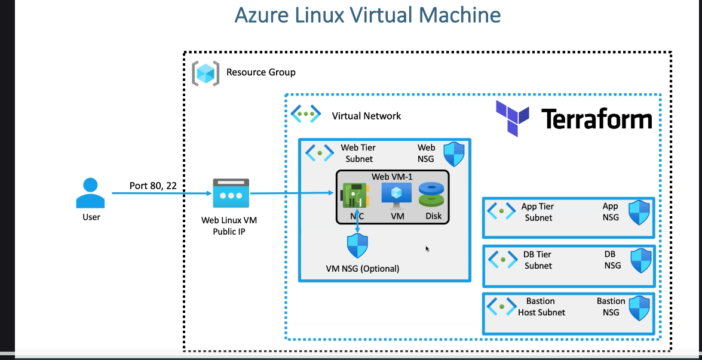
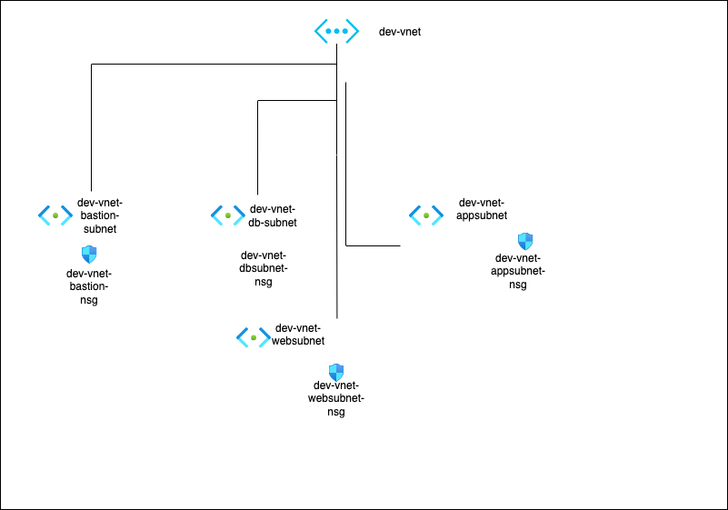

# Hands-On: Azure Linux VM

This section builds on the networking foundation created in section 05. The goal here is to provision an Azure Linux Virtual Machine with Terraform by reusing the virtual network, subnets, and security rules created earlier.

As this section grows, it will cover the full VM workflow: preparing access with SSH keys, creating the supporting Azure resources, attaching the VM to the existing network, and bootstrapping the machine for basic web server testing.


## Section Focus

In this section, we will work toward creating the following Azure resources:

- Public IP
- Network Interface
- Linux Virtual Machine
- OS Disk
- VM-related security rules where required

We will also use Terraform features and functions such as:

- `file`
- `filebase64`
- `base64encode`

### Visuals

*VNET Diagram*



*Azure VNET Network Topology*



These diagrams give a quick sense of the resources and relationships you’ll spin up.

## Dependency on the Previous Section

This module depends on the networking setup created in [05-Azure-Vnet-Subnet-NSG](../05-Azure-Vnet-Subnet-NSG/README.md).

## Pre-Requisite: Create SSH Keys for the Linux VM

Before creating the VM, generate an SSH key pair that will be used for secure login.

```bash
# Move to the manifests folder
cd terraform-manifests/

# Create a folder for SSH keys
mkdir -p ssh-keys
cd ssh-keys

# Generate the SSH key pair
ssh-keygen \
    -m PEM \
    -t rsa \
    -b 4096 \
    -C "azureuser@myserver" \
    -f terraform-azure.pem

# List the generated files
ls -lrt

# Rename the public key to match the Terraform code
mv terraform-azure.pem.pub terraform-azure.pub

# Restrict private key permissions
chmod 400 terraform-azure.pem
```

Important note: if you set a passphrase during key generation, you will need to enter that passphrase each time you connect to the VM using the private key.

Files generated:

- Public key: `terraform-azure.pub`
- Private key: `terraform-azure.pem`

Important: the current VM code reads the public key from `ssh/terraform-azure.pub`, so either keep the renamed file or update the Terraform code to match your preferred filename.

## Terraform Functions Used in This Section

This section introduces a few Terraform functions that are commonly used when provisioning virtual machines.

### `file()`

The `file()` function reads the contents of a file from disk and returns it as a string.

In this section, it is used to read the SSH public key so Terraform can pass it to Azure when creating the Linux VM.

```hcl
public_key = file("${path.module}/ssh/terraform-azure.pub")
```

### `base64encode()`

Azure expects `custom_data` to be sent in Base64-encoded form. The `base64encode()` function converts a plain string into the encoded value Azure expects.

In this section, the VM startup script is defined in a local value and then encoded before being passed to the VM resource.

```hcl
custom_data = base64encode(local.webvm_custom_data)
```

### `filebase64()`

The `filebase64()` function reads a file and returns its contents already Base64 encoded.

This is useful when your startup script is stored in a separate `.sh` file instead of being written inline in Terraform.

```hcl
# custom_data = filebase64("${path.module}/app-scripts/redhat-webvm-script.sh")
```

In the current code, `filebase64()` is shown as an alternative approach, while the active implementation uses `base64encode()` with an inline script.

## Deploy the code

Move to the Terraform manifests folder for this section and run the standard Terraform workflow.

```bash
cd 06-azure-linux-vm/tf-manifests
terraform init
terraform validate
terraform plan
terraform apply
```

### What happens during deployment

When you apply this configuration, Terraform provisions:

- A Public IP for the VM
- A Network Interface attached to the Web subnet
- A Network Security Group for the NIC
- Inbound rules for ports `80`, `443`, and `22`
- A Linux Virtual Machine based on RHEL

During VM creation, Azure also executes the `custom_data` script. That script installs `httpd`, starts the web server, creates sample HTML pages, and writes instance metadata into one of the application pages.

### Useful Terraform commands after apply

After deployment, you can print the key outputs from Terraform:

```bash
terraform output
terraform output web_linuxvm_public_ip
terraform output web_linuxvm_network_interface_private_ip
terraform output web_linuxvm_id
```


## After Deploying the Code

1. Verify the resources in Azure Portal.
2. Get the VM public IP using `terraform output web_linuxvm_public_ip`.
3. Connect to the VM:

```bash
ssh -i ssh/terraform-azure.pem azureuser@<your_public_ip>
```

4. If needed, switch to the root user:

```bash
sudo su -
```

5. Review the cloud-init execution log:

```bash
tail -200f /var/log/cloud-init-output.log
```

6. Confirm that `httpd` was installed and started successfully.
7. If there is an issue with bootstrapping, inspect the log output and rerun the relevant commands manually for troubleshooting.
8. Verify that the web server process is running:

```bash
ps -ef | grep httpd
systemctl status httpd
```

### Validate the html pages

After the VM is up and the startup script completes, validate the sample pages in your browser:

- `http://<your_public_ip>`
- `http://<your_public_ip>/app1/`
- `http://<your_public_ip>/app1/hostname.html`
- `http://<your_public_ip>/app1/status.html`
- `http://<your_public_ip>/app1/metadata.html`

The `metadata.html` page is populated using the Azure Instance Metadata Service, so it is a useful quick check to confirm that the VM bootstrap script ran successfully.
